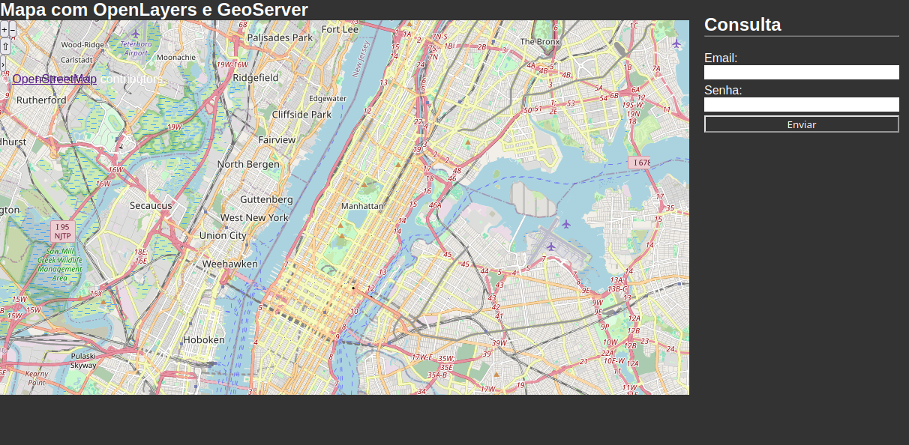

# Starting with WebGIS

 This is my first WebGIS project using OpenLayers, PHP, GeoServer, PostgreSQL, and Docker.
## Install

Up PostgreSQL and Geoserver container with docker-compose
```bash
sudo docker-compose up -d
```

Run scipt to test databse conection
```bash
cd bin/
chmod +x ./testdb.sh
sudo ./testdb.sh
```

Run scripts of database population
```bash
cd bin/
chmod +x ./createtables.sh
sudo ./createtables.sh
```

## Creating a new user

To use the system, you need to create a new user with the command-line utility in the bin/ folder:
```bash
cd bin/
chmod +x ./createuser.sh
sudo ./createuser.sh
```

After this, you can check the user's location with your credentials and view it on the map.